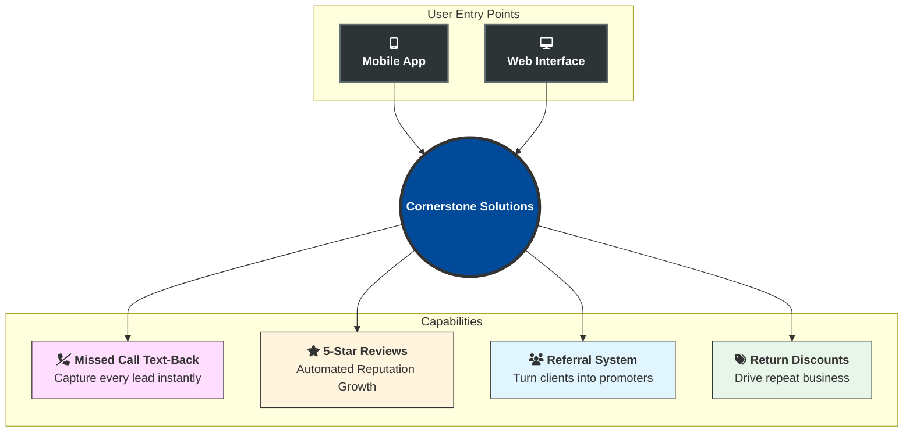

```mermaid

graph TD
    %% Central Hub
    Hub((<b>Cornerstone Solutions</b>))

    %% Entry Points (The "How")
    subgraph Capture["User Entry Points"]
        App[fa:fa-mobile-alt <br/><b>Mobile App</b>] 
        Web[fa:fa-desktop <br/><b>Web Interface</b>]
    end

    %% The 4 Core Value Pillars
    subgraph Features["Capabilities"]
        MCTB[fa:fa-phone-slash <b>Missed Call Text-Back</b><br/>Capture every lead instantly]
        Reviews[fa:fa-star <b>5-Star Reviews</b><br/>Automated Reputation Growth]
        Ref[fa:fa-users <b>Referral System</b><br/>Turn clients into promoters]
        Ret[fa:fa-tags <b>Return Discounts</b><br/>Drive repeat business]
    end

    %% Connections
    App --> Hub
    Web --> Hub
    
    Hub --> MCTB
    Hub --> Reviews
    Hub --> Ref
    Hub --> Ret

    %% Professional Styling
    style Hub fill:#004a99,color:#fff,stroke:#333,stroke-width:4px
    
    %% The "Classy" Entry Point Styling
    style App fill:#2d3436,color:#fff,stroke:#636e72,stroke-width:2px
    style Web fill:#2d3436,color:#fff,stroke:#636e72,stroke-width:2px

    %% Feature Styling
    style MCTB fill:#fdf,stroke:#333
    style Reviews fill:#fff4dd,stroke:#333
    style Ref fill:#e1f5fe,stroke:#333
    style Ret fill:#e8f5e9,stroke:#333
```
